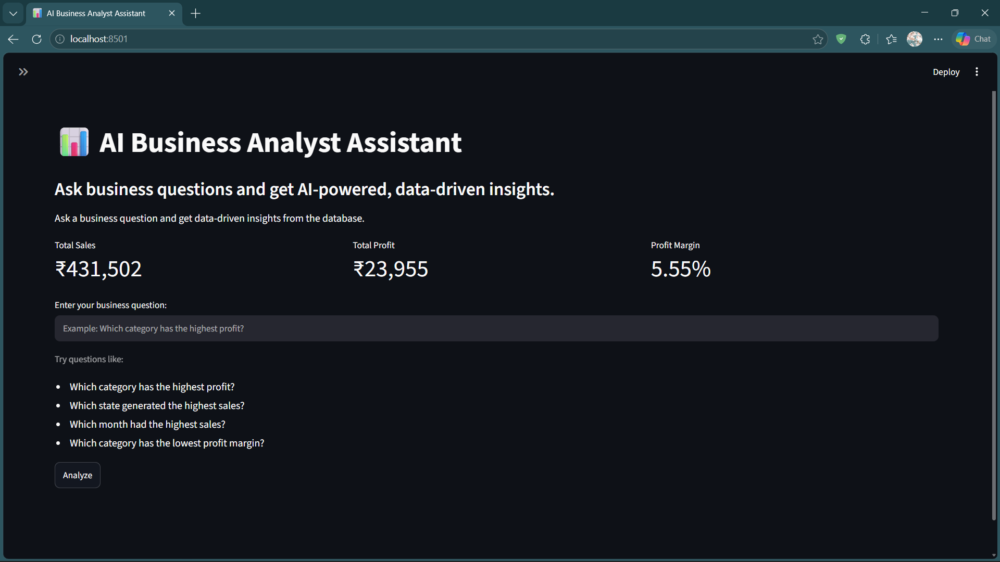

# 🤖 AI Business Analyst Assistant

An AI-powered business analytics assistant that allows users to ask business questions in natural language and receive data-driven answers from a structured business database.

The application converts natural-language questions into SQL queries, validates the generated SQL, executes the query against a SQLite database, and uses AI to explain the results in simple business language.

---

## 📸 Dashboard Preview



---

## 📌 Business Problem

Business analysts often spend significant time answering repetitive questions such as:

- Which category generated the highest profit?
- Which month had the highest sales?
- Which state has the highest sales?
- Which category has the lowest profit margin?
- Where are the major losses occurring?

This project demonstrates an AI-assisted analytics workflow that helps answer these questions more efficiently.

---

## 💡 Solution

The **AI Business Analyst Assistant** allows a business user to enter a question in natural language.

The system then:

1. Understands the business question using an LLM.
2. Generates a SQLite SQL query.
3. Validates the SQL query for safety.
4. Executes the query against the business database.
5. Retrieves the relevant results.
6. Generates a concise business insight.
7. Displays the result in a Streamlit dashboard.
8. Creates a visualization when appropriate.

---

## 🏗️ Architecture

```text
Business User
      ↓
Natural-Language Question
      ↓
AI Business Analyst Assistant
      ↓
AI-Generated SQL
      ↓
SQL Validation
      ↓
SQLite Database
      ↓
Query Results
      ↓
AI Business Insight
      ↓
Streamlit Dashboard
      ↓
Visualization